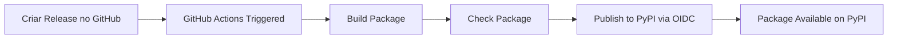

# 🔐 Guia: Trusted Publishing no PyPI

> Publicação automática via GitHub Actions sem precisar de tokens!

---

## 🎯 O Que É Trusted Publishing?

É uma forma **mais segura** de publicar pacotes Python:
- ✅ **Sem tokens**: Não precisa criar/gerenciar tokens de API
- ✅ **Mais seguro**: Usa OpenID Connect (OIDC)
- ✅ **Automático**: Publica automaticamente quando criar uma release no GitHub
- ✅ **Recomendado pelo PyPI**: Método oficial e preferido

---

## 📋 Passo a Passo Completo

### **1. Criar Conta no PyPI**

Se ainda não tem:
1. Acesse: https://pypi.org/account/register/
2. Preencha: Username, Email, Password
3. Confirme o email

### **2. Configurar Trusted Publishing no PyPI**

1. **Faça login** em: https://pypi.org
2. **Acesse**: https://pypi.org/manage/account/publishing/
3. **Clique em**: "Add a new pending publisher"
4. **Preencha o formulário**:

```
┌─────────────────────────────────────────────────────────┐
│ Nome do Projeto PyPI (obrigatório)                     │
│ ┌─────────────────────────────────────────────────┐   │
│ │ hermes-notifier                                  │   │
│ └─────────────────────────────────────────────────┘   │
│                                                         │
│ Proprietário (obrigatório)                             │
│ ┌─────────────────────────────────────────────────┐   │
│ │ raphab3                                          │   │
│ └─────────────────────────────────────────────────┘   │
│                                                         │
│ Nome de repositório (obrigatório)                      │
│ ┌─────────────────────────────────────────────────┐   │
│ │ raphab3/plugin-hermes-notifier-python            │   │
│ └─────────────────────────────────────────────────┘   │
│                                                         │
│ Nome do fluxo de trabalho (obrigatório)                │
│ ┌─────────────────────────────────────────────────┐   │
│ │ publish.yml                                      │   │
│ └─────────────────────────────────────────────────┘   │
│                                                         │
│ Nome do ambiente (opcional)                            │
│ ┌─────────────────────────────────────────────────┐   │
│ │ pypi                                             │   │
│ └─────────────────────────────────────────────────┘   │
│                                                         │
│              [ Adicionar ]                             │
└─────────────────────────────────────────────────────────┘
```

5. **Clique em "Adicionar"**

---

### **3. Copiar Workflows para o Repositório**

Os arquivos já foram criados em:
- `.github/workflows/publish.yml` - Publica no PyPI
- `.github/workflows/test-publish.yml` - Publica no TestPyPI (testes)

**Você precisa copiar esses arquivos para o novo repositório!**

---

### **4. Criar o Repositório no GitHub**

```bash
# 1. Clonar o novo repositório
cd ~/Documents/projetos/EM2/
git clone git@github.com:raphab3/plugin-hermes-notifier-python.git
cd plugin-hermes-notifier-python

# 2. Copiar arquivos do plugin
cp -r ~/Documents/projetos/EM2/hermes-notifications/plugins/python/* .

# 3. Criar .gitignore
cat > .gitignore << 'EOF'
__pycache__/
*.py[cod]
*$py.class
*.so
.Python
build/
develop-eggs/
dist/
downloads/
eggs/
.eggs/
lib/
lib64/
parts/
sdist/
var/
wheels/
*.egg-info/
.installed.cfg
*.egg
venv/
ENV/
.vscode/
.idea/
.DS_Store
*.log
EOF

# 4. Commit inicial
git add .
git commit -m "feat: initial commit - Hermes Notifier Python Plugin v1.1.0"
git push origin main
```

---

### **5. Configurar GitHub Environment (Opcional mas Recomendado)**

1. Acesse: `https://github.com/raphab3/plugin-hermes-notifier-python/settings/environments`
2. Clique em "New environment"
3. Nome: `pypi`
4. Clique em "Configure environment"
5. (Opcional) Adicione "Required reviewers" para aprovar antes de publicar
6. Salve

Repita para criar environment `testpypi` se quiser.

---

### **6. Publicar uma Release**

#### **Opção 1: Via GitHub Interface**

1. Acesse: `https://github.com/raphab3/plugin-hermes-notifier-python/releases/new`
2. Preencha:
   - **Tag**: `v1.1.0`
   - **Release title**: `v1.1.0 - Initial Release`
   - **Description**: 
     ```markdown
     ## 🎉 Initial Release
     
     ### Features
     - ✅ SSE (Server-Sent Events) support
     - ✅ HTTP API client
     - ✅ Unified client (HTTP + SSE)
     - ✅ Django integration
     - ✅ Push notifications support
     - ✅ Group notifications
     - ✅ Mark as read/unread
     
     ### Installation
     ```bash
     pip install hermes-notifier
     ```
     
     ### Documentation
     See [README.md](https://github.com/raphab3/plugin-hermes-notifier-python#readme)
     ```
3. Marque "Set as the latest release"
4. Clique em "Publish release"

#### **Opção 2: Via Git CLI**

```bash
# Criar tag
git tag -a v1.1.0 -m "v1.1.0 - Initial Release"
git push origin v1.1.0

# Depois criar a release no GitHub interface
```

---

### **7. Verificar Publicação**

1. **GitHub Actions**: 
   - Acesse: `https://github.com/raphab3/plugin-hermes-notifier-python/actions`
   - Veja o workflow "Publish Python Package" rodando

2. **PyPI**:
   - Aguarde alguns minutos
   - Acesse: https://pypi.org/project/hermes-notifier/
   - Deve aparecer a versão 1.1.0

3. **Testar instalação**:
   ```bash
   pip install hermes-notifier
   python3 -c "from hermes_notifier import HermesUnifiedClient; print('✅ OK')"
   ```

---

## 🧪 Testar no TestPyPI Primeiro

### **1. Configurar Trusted Publishing no TestPyPI**

1. Acesse: https://test.pypi.org/manage/account/publishing/
2. Preencha o mesmo formulário (use `test-publish.yml` como workflow)

### **2. Criar Tag de Teste**

```bash
git tag -a v1.1.0-test -m "Test release"
git push origin v1.1.0-test
```

### **3. Verificar**

- GitHub Actions: Workflow "Test Publish to TestPyPI" deve rodar
- TestPyPI: https://test.pypi.org/project/hermes-notifier/

---

## 📝 Resumo dos Arquivos Criados

```
plugins/python/
├── .github/
│   └── workflows/
│       ├── publish.yml           # Publica no PyPI
│       └── test-publish.yml      # Publica no TestPyPI
├── hermes_notifier/
├── setup.py
├── README.md
├── CHANGELOG.md
└── ...
```

---

## 🔄 Fluxo de Publicação



---

## ✅ Checklist Final

### **Antes de Publicar**
- [ ] Conta criada no PyPI
- [ ] Trusted Publishing configurado no PyPI
- [ ] Repositório criado no GitHub
- [ ] Workflows copiados para `.github/workflows/`
- [ ] Código commitado e pushed
- [ ] (Opcional) GitHub Environment configurado

### **Publicar**
- [ ] Criar release no GitHub (tag `v1.1.0`)
- [ ] Aguardar GitHub Actions completar
- [ ] Verificar em https://pypi.org/project/hermes-notifier/
- [ ] Testar instalação: `pip install hermes-notifier`

---

## 🎯 Vantagens do Trusted Publishing

| Método | Trusted Publishing | Token Manual |
|--------|-------------------|--------------|
| **Segurança** | ✅ Muito alta | ⚠️ Média |
| **Configuração** | ✅ Uma vez | ❌ Sempre |
| **Rotação de credenciais** | ✅ Automática | ❌ Manual |
| **Auditoria** | ✅ Completa | ⚠️ Limitada |
| **Recomendado pelo PyPI** | ✅ Sim | ❌ Não |

---

## 🐛 Troubleshooting

### **Erro: "Trusted publisher is not configured"**

**Causa**: Formulário no PyPI não foi preenchido corretamente

**Solução**:
1. Verifique em https://pypi.org/manage/account/publishing/
2. Certifique-se que o "pending publisher" foi criado
3. Verifique se o nome do repositório está correto

### **Erro: "Workflow file not found"**

**Causa**: Arquivo `.github/workflows/publish.yml` não existe no repositório

**Solução**:
1. Certifique-se que copiou os workflows
2. Commit e push: `git add .github/ && git commit -m "Add workflows" && git push`

### **Erro: "Environment not found"**

**Causa**: Environment `pypi` não foi criado no GitHub

**Solução**:
1. Remova a linha `environment:` do workflow, OU
2. Crie o environment em Settings > Environments

---

## 📚 Links Úteis

- **PyPI Trusted Publishing**: https://docs.pypi.org/trusted-publishers/
- **GitHub Actions**: https://docs.github.com/en/actions
- **PyPA Publish Action**: https://github.com/pypa/gh-action-pypi-publish

---

**Pronto! Agora você pode publicar automaticamente no PyPI! 🎉**

